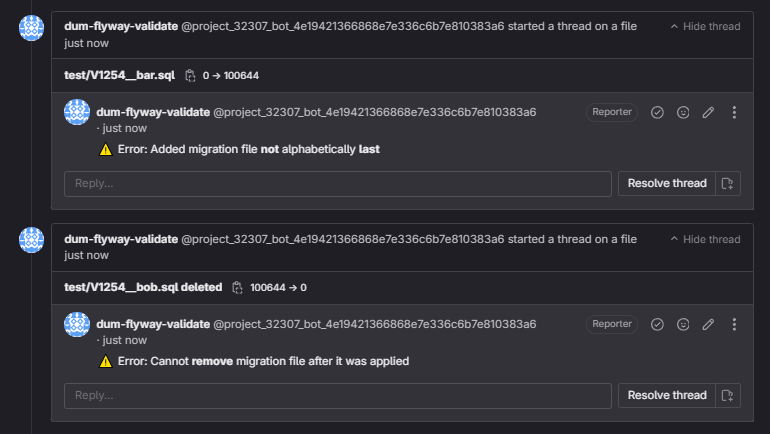

<div align="center">
  

  # Dum Flyway Validate

  Dum Flyway Validate is a command-line tool to locally validate Flyway migrations. It ensures migration consistency using Git and specific conditions.

</div>

## Usage

### Standard Usage

```bash
./dum-flyway-validate --migration-dir path/to/migrations --branch your-branch
```

## Conditions Checked

- **Modified Migration File:** Error if modified after being applied.
  
- **Added Migration File:** Error if not alphabetically last in the specified directory.

- **Removed Migration File:** Error if removed after being applied.
  
- **Renamed Migration File:** Error if renamed after being applied.

## Additional Options

- `--migration-dir`: Specifies the migration directory (default: current directory).
- `--branch`: Specifies the branch to compare against (default: empty, i.e., working directory).
- `--debug`: Enable debug mode.
- `--integration`: Enable integration with GitLab merge request interface.

## GitLab Integration

To allow for integration with the GitLab Merge Request interface, follow these steps:

1. Create an access token from the repository settings on GitLab with the **Reporter** role. Select the **api** scope during token creation. The name of this access token is the name that will be displayed on the report.

2. Add this access token to your CI/CD variables as `GITLAB_TOKEN`.

3. Set your GitLab URL as an environment variable in your CI script. Follow this standard: `https://gitlab.com/api`.

4. Ensure that in your CI script, you run the binary with the `--integration` flag to enable GitLab integration.



## Continuous Integration Example

Here is an example of integrating Dum Flyway Validate into your CI pipeline:

```yaml
stages:
  - validate

variables:
  DUM_FLYWAY_VALIDATE_VERSION: "v0.2.5"
  MIGRATION_DIR: "path/to/migrations"
  BRANCH_TO_COMPARE: "origin/your-branch"

validate:
  stage: validate
  image: alpine:latest
  script:
    - apk --update add curl git
    - curl -LO https://github.com/Qypol342/dum-flyway-validate/releases/download/$DUM_FLYWAY_VALIDATE_VERSION/dum-flyway-validate
    - chmod +x dum-flyway-validate
    - git fetch origin
    - ./dum-flyway-validate --migration-dir $MIGRATION_DIR --branch $BRANCH_TO_COMPARE --integration
```

## Contributing

Contributions are welcome! Feel free to submit issues or pull requests.

## License

[GNU3 License](LICENSE)
